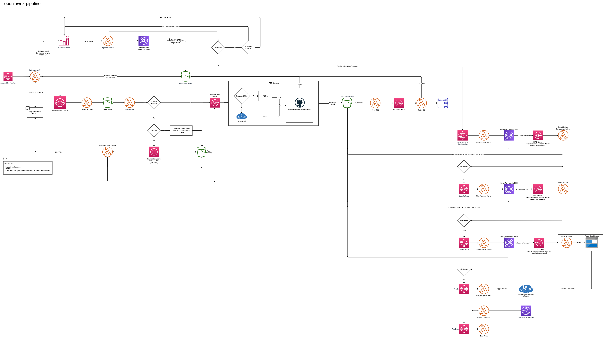

# OpenLaw NZ Data Pipeline
This is the OpenLaw NZ data ingest and parser pipeline. Given a common JSON file format it:
- Downloads PDF files to AWS s3 (ingester, filefetcher)
- Obtains and parses the text content, sending files to Azure cognitive services for OCR if necessary (pdfconverter)
- Saves results to separate s3 buckets in JSON format (pdfconverter)
- Inserts the results to a postgres database (putInDB)
- Triggers a cloudwatch rule to monitor whether an ingest is complete (ingesterWatcher)
- On completion, stops the watcher and start step functions to carry out additional parsing which must be done sequentially (parseCaseCitations, parseCaseToCase)

## Structure

Each subdirectory is designed to be set up as a serverless function on AWS Lambda.

The flow between Lambda functions must be linked with [s3 events notifications](https://docs.aws.amazon.com/lambda/latest/dg/with-s3.html) and [sqs queues](https://aws.amazon.com/sqs/) to ensure batching, rate limiting, and retryability. 

This code is straight from Cloud9 IDE on AWS and is deliberately missing the `template.yaml` files to make it work. If you're an AWS Cloudformation guru please get in touch.

# How to run

The pipeline is started by running `/ingester`. The ingester downloads case law and other legal information to s3.

The ingester must be set up as a lambda function with environment variables. See the ingester README for further details.

